<h1>
  
  <span>GameHub</span>
</h1>

Game Hub displays games, supports searching, filtering by platform/genre, and shows game details. The app uses React Query for data fetching and caching, Chakra UI for the design system, and axios for API requests.

## [Live Demo](https://game-hub-two-sandy.vercel.app/)

## Tech stack

- React ^19.1.1
- Vite ^7.1.7
- TypeScript ~5.8.3
- @tanstack/react-query ^5.90.2
- @chakra-ui/react ^3.27.0
- @emotion/react ^11.14.0
- axios ^1.12.2
- react-router-dom ^7.9.4
- zustand ^5.0.8
- react-icons ^5.5.0

## High-level project layout

```
/ (repo root)
├─ index.html
├─ package.json
├─ vite.config.ts
├─ tsconfig.json
├─ public/
└─ src/
   ├─ main.tsx             # Application entry (providers + router)
   ├─ routes/              # Router and route configuration
   ├─ pages/               # Route page components (index, GameDetail, NotFound)
   ├─ components/          # Reusable components (GameCard, GameGrid, etc.)
   ├─ providers/           # Chakra, Network, QueryClient provider wrappers
   ├─ services/            # API-Client.ts (axios instance) and service helpers
   ├─ hooks/               # Custom hooks (useGames, useGame, useGenres, etc.)
   ├─ store/               # zustand stores
   ├─ theme/               # Chakra UI theme overrides
   ├─ utils/               # Utility helpers
   └─ interfaces/          # TypeScript interfaces
```

## Screenshots

Home / main views

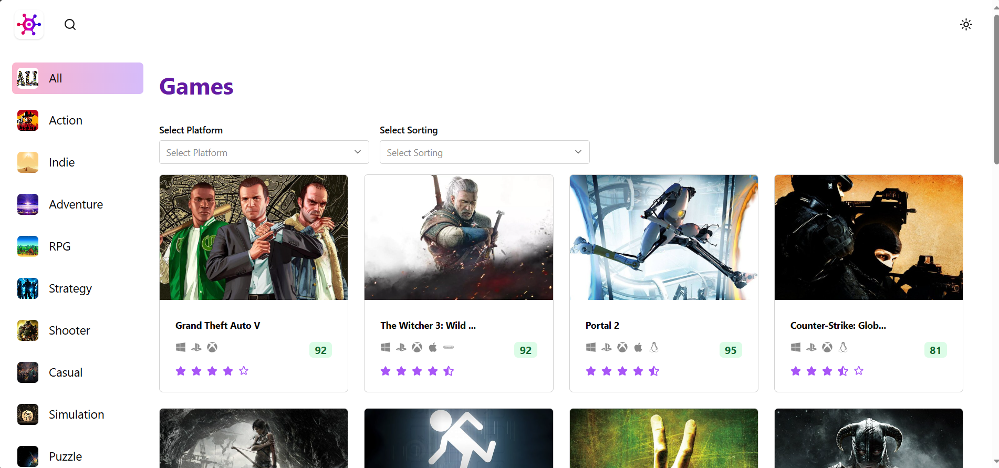

Network Connection

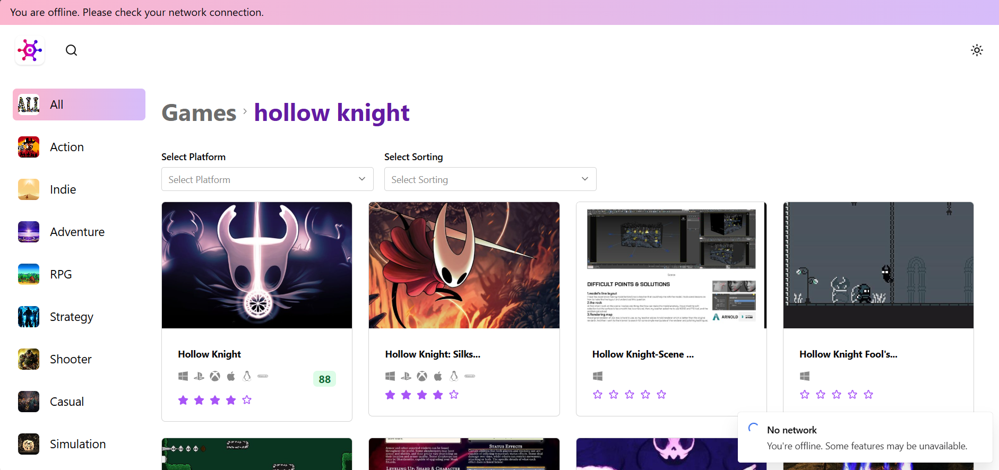
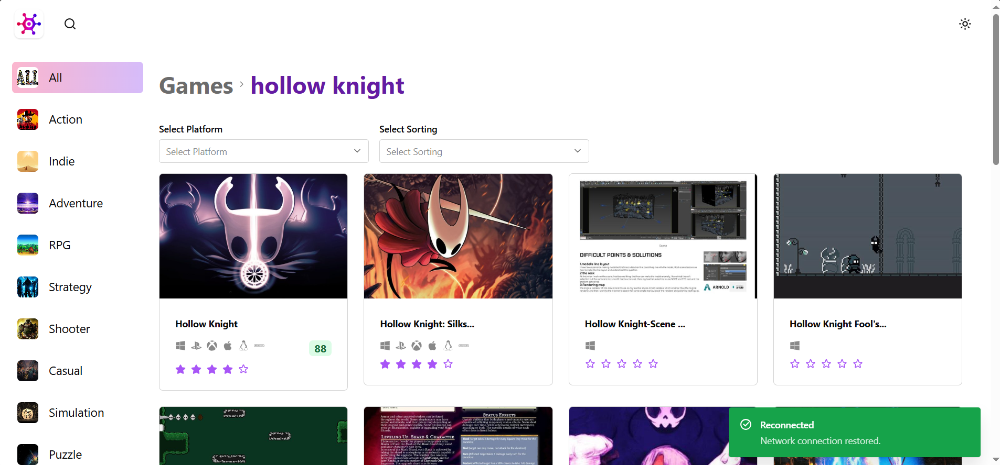
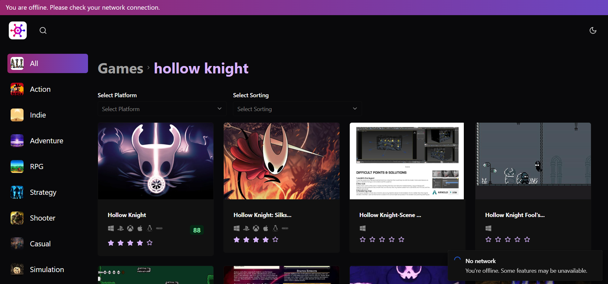
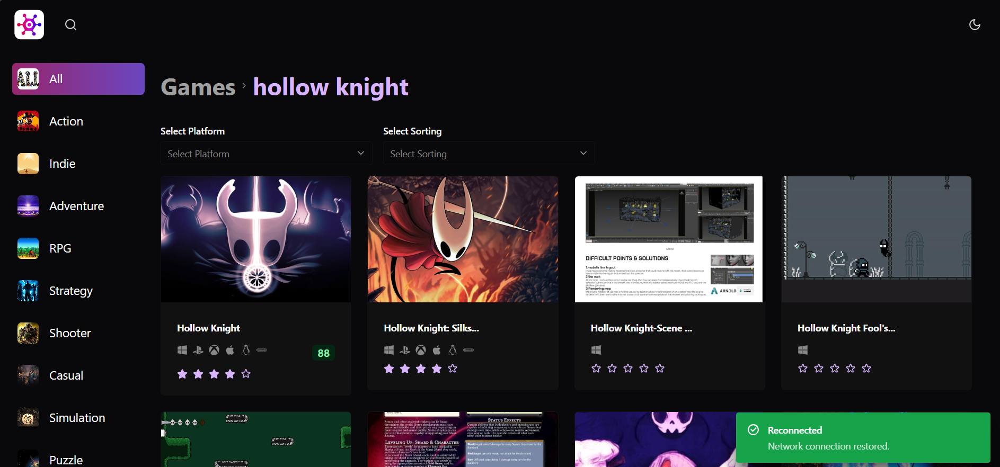

Search & results

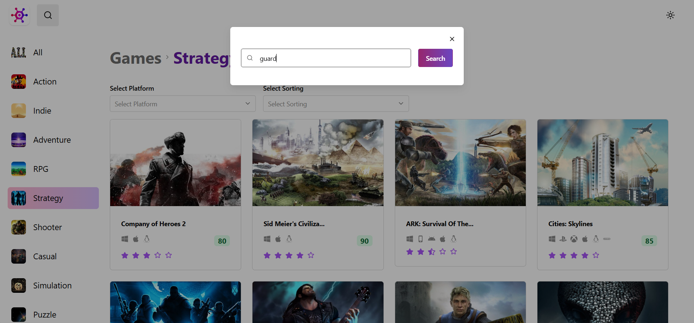
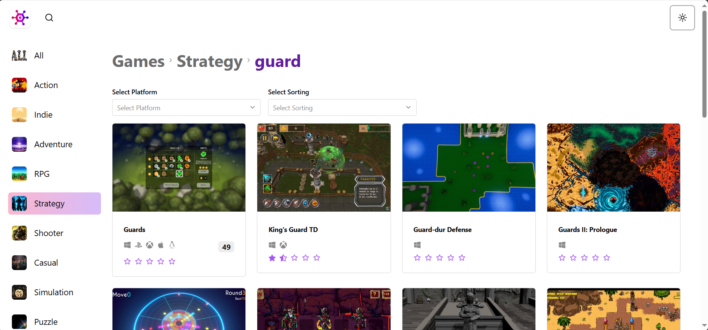

Game details

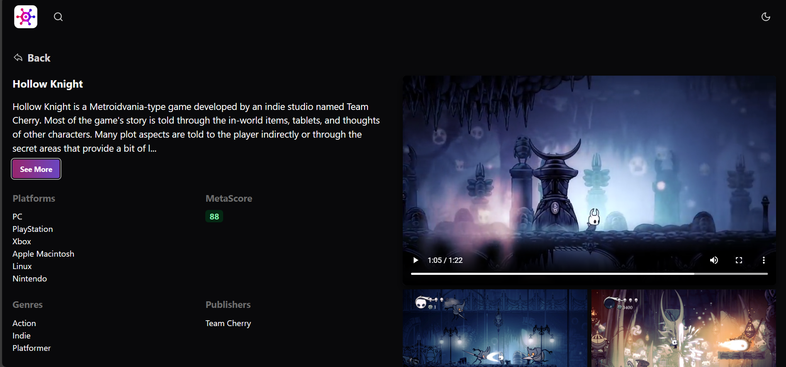
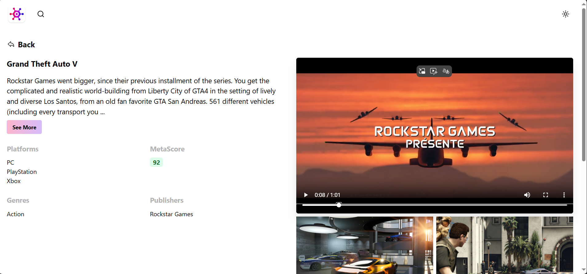

genre/ Platform / sort - filtering

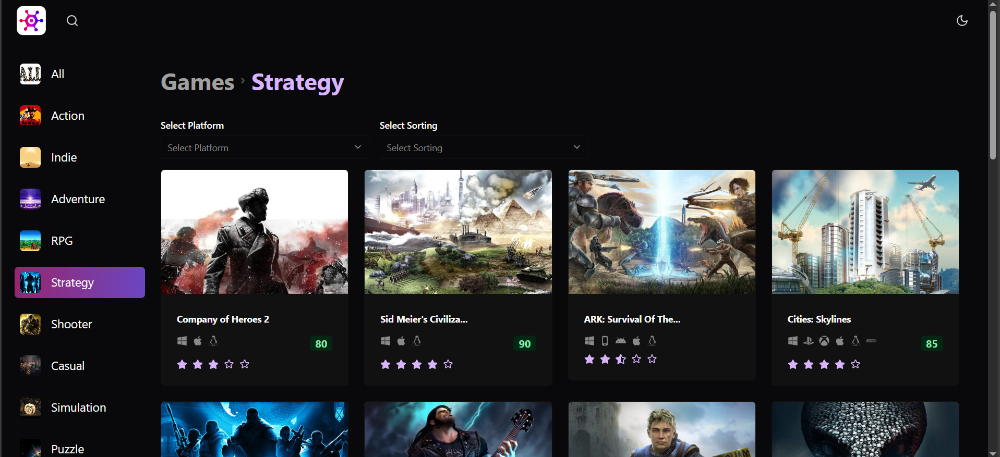
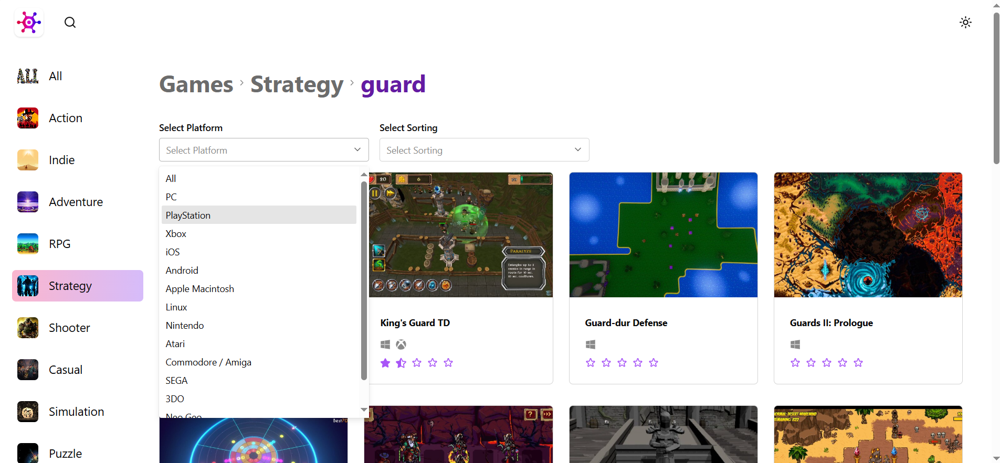
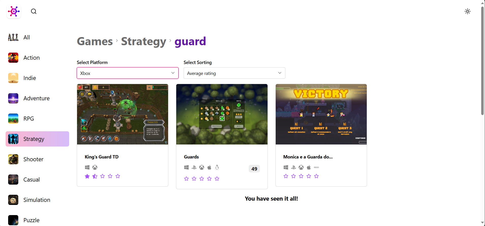

Mobile / drawer

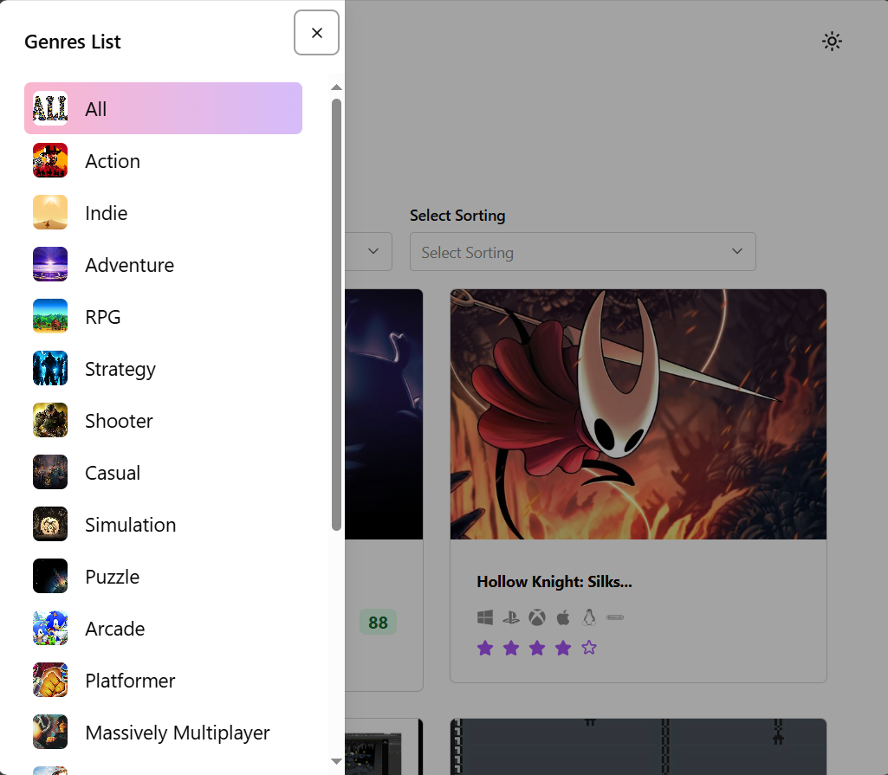
